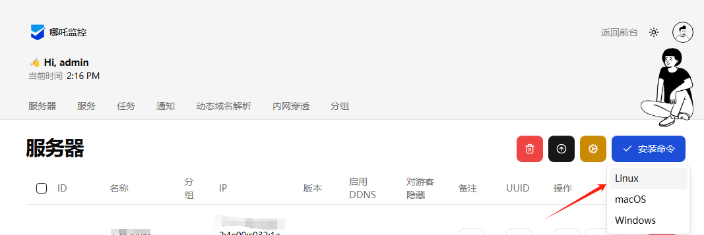

# OpenWrt哪吒监控Agent一键安装脚本

## 项目简介
这是一个用于在OpenWrt系统上安装哪吒监控Agent的一键安装脚本。哪吒监控是一个开源的服务器监控系统，可以帮助您实时监控服务器的运行状态。
脚本会自动从官方github仓库下载最新版本的Agent，并进行安装。

## 系统要求
- OpenWrt系统
- Root权限
- 网络连接
- 支持的系统架构：
  - x86_64 (amd64)
  - aarch64/arm64
  - armv7l/armv6l
  - mips
  - mips64

## 安装步骤

### 一键安装命令
```bash
wget -O nezha_openwrt.sh https://raw.githubusercontent.com/vbskycn/nezha_openwrt/main/nezha_openwrt.sh && chmod +x nezha_openwrt.sh && ./nezha_openwrt.sh
```
#### 国内网无法访问github的用下面的，如果失效请自己更换代理
```
wget -O nezha_openwrt.sh https://gh-proxy.com/raw.githubusercontent.com/vbskycn/nezha_openwrt/main/nezha_openwrt.sh && chmod +x nezha_openwrt.sh && ./nezha_openwrt.sh
```


### 分步安装

#### 1. 下载脚本
```bash
wget https://raw.githubusercontent.com/vbskycn/nezha_openwrt/main/nezha_openwrt.sh
```

#### 2. 添加执行权限
```bash
chmod +x nezha_openwrt.sh
```

#### 3. 运行安装脚本
```bash
./nezha_openwrt.sh
```

## 配置说明
安装过程中需要配置以下参数：

1. 服务器地址：哪吒监控面板的地址

2. 客户端密钥：在面板中生成的客户端密钥

   

   **复制安装地址后里面有一串密钥**

3. TLS：是否启用TLS加密连接

4. GPU监控：是否启用GPU监控

5. 温度监控：是否启用温度监控

## 使用说明

### 服务管理
- 启动服务：
```bash
/etc/init.d/nezha-service start
```

- 停止服务：
```bash
/etc/init.d/nezha-service stop
```

- 重启服务：
```bash
/etc/init.d/nezha-service restart
```

### 配置文件位置
- 安装目录：`/etc/nezha`
- 配置文件：`/etc/nezha/config.yml`

## 常见问题

### 1. 安装失败
- 检查是否具有root权限
- 检查网络连接是否正常
- 检查系统架构是否支持

### 2. 服务无法启动
- 检查配置文件是否正确
- 检查服务器地址是否可以访问
- 检查客户端密钥是否正确

### 3. 监控数据不显示
- 检查网络连接
- 检查服务是否正常运行
- 检查面板配置是否正确

## 注意事项
1. 安装前请确保系统有足够的存储空间
2. 建议在安装前备份重要数据
3. 确保网络环境稳定
4. 建议使用TLS加密连接以提高安全性

## 技术支持
如有问题，请提交Issue或Pull Request：
- GitHub: https://github.com/vbskycn/nezha_openwrt 


## 方便的同学请给个Star